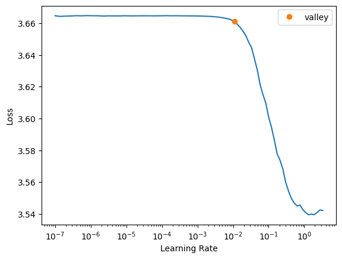
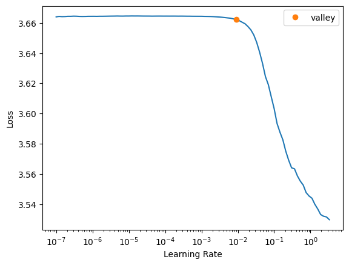
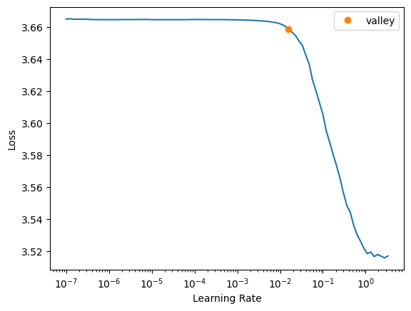
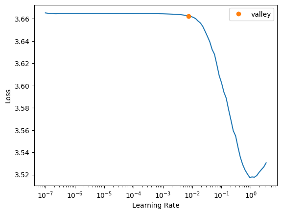
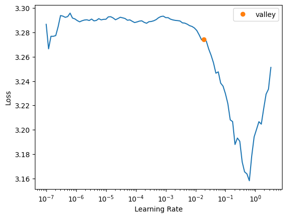
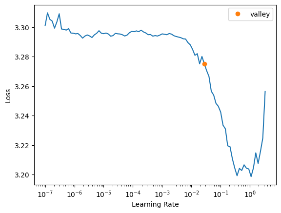
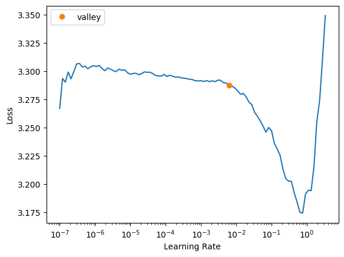
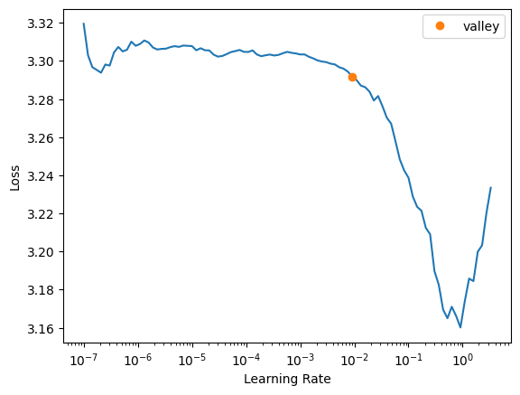
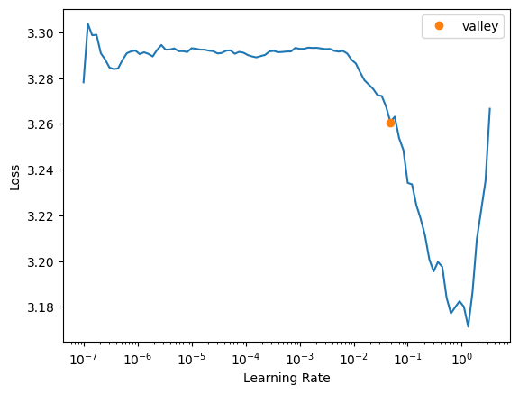

# pympp

<!-- WARNING: THIS FILE WAS AUTOGENERATED! DO NOT EDIT! -->

## Install

``` sh
pip install pympp
```

## How to use

**Process Prediction**

``` python
from pympp.process import *
from pympp.prediction.predict import *
```

``` python
col='activity'
o=PPObj(log,procs=Categorify(),cat_names=col,y_names=col,splits=split_traces(log))
o.show()
```

    #traces: 12616 #events: 249149

|          | activity |
|----------|----------|
| trace_id |          |
| 203940   | 2        |
| 203940   | 12       |
| 203940   | 9        |

``` python
dls=o.get_dls()
m=RNNwEmbedding(o)
train_validate(dls,m,epoch=5,metrics=accuracy_targ0,loss=cross_entropy_targ0)
```

<style>
    /* Turns off some styling */
    progress {
        /* gets rid of default border in Firefox and Opera. */
        border: none;
        /* Needs to be in here for Safari polyfill so background images work as expected. */
        background-size: auto;
    }
    progress:not([value]), progress:not([value])::-webkit-progress-bar {
        background: repeating-linear-gradient(45deg, #7e7e7e, #7e7e7e 10px, #5c5c5c 10px, #5c5c5c 20px);
    }
    .progress-bar-interrupted, .progress-bar-interrupted::-webkit-progress-bar {
        background: #F44336;
    }
</style>


<style>
    /* Turns off some styling */
    progress {
        /* gets rid of default border in Firefox and Opera. */
        border: none;
        /* Needs to be in here for Safari polyfill so background images work as expected. */
        background-size: auto;
    }
    progress:not([value]), progress:not([value])::-webkit-progress-bar {
        background: repeating-linear-gradient(45deg, #7e7e7e, #7e7e7e 10px, #5c5c5c 10px, #5c5c5c 20px);
    }
    .progress-bar-interrupted, .progress-bar-interrupted::-webkit-progress-bar {
        background: #F44336;
    }
</style>


<style>
    /* Turns off some styling */
    progress {
        /* gets rid of default border in Firefox and Opera. */
        border: none;
        /* Needs to be in here for Safari polyfill so background images work as expected. */
        background-size: auto;
    }
    progress:not([value]), progress:not([value])::-webkit-progress-bar {
        background: repeating-linear-gradient(45deg, #7e7e7e, #7e7e7e 10px, #5c5c5c 10px, #5c5c5c 20px);
    }
    .progress-bar-interrupted, .progress-bar-interrupted::-webkit-progress-bar {
        background: #F44336;
    }
</style>


<style>
    /* Turns off some styling */
    progress {
        /* gets rid of default border in Firefox and Opera. */
        border: none;
        /* Needs to be in here for Safari polyfill so background images work as expected. */
        background-size: auto;
    }
    progress:not([value]), progress:not([value])::-webkit-progress-bar {
        background: repeating-linear-gradient(45deg, #7e7e7e, #7e7e7e 10px, #5c5c5c 10px, #5c5c5c 20px);
    }
    .progress-bar-interrupted, .progress-bar-interrupted::-webkit-progress-bar {
        background: #F44336;
    }
</style>


<style>
    /* Turns off some styling */
    progress {
        /* gets rid of default border in Firefox and Opera. */
        border: none;
        /* Needs to be in here for Safari polyfill so background images work as expected. */
        background-size: auto;
    }
    progress:not([value]), progress:not([value])::-webkit-progress-bar {
        background: repeating-linear-gradient(45deg, #7e7e7e, #7e7e7e 10px, #5c5c5c 10px, #5c5c5c 20px);
    }
    .progress-bar-interrupted, .progress-bar-interrupted::-webkit-progress-bar {
        background: #F44336;
    }
</style>


<style>
    /* Turns off some styling */
    progress {
        /* gets rid of default border in Firefox and Opera. */
        border: none;
        /* Needs to be in here for Safari polyfill so background images work as expected. */
        background-size: auto;
    }
    progress:not([value]), progress:not([value])::-webkit-progress-bar {
        background: repeating-linear-gradient(45deg, #7e7e7e, #7e7e7e 10px, #5c5c5c 10px, #5c5c5c 20px);
    }
    .progress-bar-interrupted, .progress-bar-interrupted::-webkit-progress-bar {
        background: #F44336;
    }
</style>

| epoch | train_loss | valid_loss | accuracy_targ0 | time  |
|-------|------------|------------|----------------|-------|
| 0     | 2.897732   | 2.902493   | 0.804733       | 00:20 |
| 1     | 2.894417   | 2.889455   | 0.817099       | 00:19 |
| 2     | 2.899381   | 2.889609   | 0.817048       | 00:21 |
| 3     | 2.889103   | 2.889244   | 0.817354       | 00:20 |
| 4     | 2.886401   | 2.889135   | 0.817455       | 00:21 |

    Better model found at epoch 0 with valid_loss value: 2.9024930000305176.
    Better model found at epoch 1 with valid_loss value: 2.8894548416137695.
    Better model found at epoch 3 with valid_loss value: 2.8892438411712646.
    Better model found at epoch 4 with valid_loss value: 2.8891353607177734.
    No improvement since epoch 1: early stopping
    Better model found at epoch 0 with valid_loss value: 0.8141778111457825.

<style>
    /* Turns off some styling */
    progress {
        /* gets rid of default border in Firefox and Opera. */
        border: none;
        /* Needs to be in here for Safari polyfill so background images work as expected. */
        background-size: auto;
    }
    progress:not([value]), progress:not([value])::-webkit-progress-bar {
        background: repeating-linear-gradient(45deg, #7e7e7e, #7e7e7e 10px, #5c5c5c 10px, #5c5c5c 20px);
    }
    .progress-bar-interrupted, .progress-bar-interrupted::-webkit-progress-bar {
        background: #F44336;
    }
</style>

    0.8141778111457825










**Anomaly Detection**

``` python
from pympp.anomaly.detect import *
from fastai.basics import *
from sklearn.metrics import f1_score
```

``` python
log = import_log('./data/logs/csv/dapnn_ds/PDC2020_training/pdc_2020_0101100.csv.gz')
log.head()
```

<div>
<style scoped>
    .dataframe tbody tr th:only-of-type {
        vertical-align: middle;
    }
&#10;    .dataframe tbody tr th {
        vertical-align: top;
    }
&#10;    .dataframe thead th {
        text-align: right;
    }
</style>

|          | activity     | event_id |
|----------|--------------|----------|
| trace_id |              |          |
| trace 1  | \###start### | 0        |
| trace 1  | t31          | 1        |
| trace 1  | t41          | 2        |
| trace 1  | t26          | 3        |
| trace 1  | t36          | 4        |

</div>

``` python
o,dls,categorify = training_dl(log)
```

``` python
m=ControlFlowModel(o)
train_validate(dls,m,epoch=25,metrics=accuracy_targ0,loss=cross_entropy_targ0)
```

<style>
    /* Turns off some styling */
    progress {
        /* gets rid of default border in Firefox and Opera. */
        border: none;
        /* Needs to be in here for Safari polyfill so background images work as expected. */
        background-size: auto;
    }
    progress:not([value]), progress:not([value])::-webkit-progress-bar {
        background: repeating-linear-gradient(45deg, #7e7e7e, #7e7e7e 10px, #5c5c5c 10px, #5c5c5c 20px);
    }
    .progress-bar-interrupted, .progress-bar-interrupted::-webkit-progress-bar {
        background: #F44336;
    }
</style>


<style>
    /* Turns off some styling */
    progress {
        /* gets rid of default border in Firefox and Opera. */
        border: none;
        /* Needs to be in here for Safari polyfill so background images work as expected. */
        background-size: auto;
    }
    progress:not([value]), progress:not([value])::-webkit-progress-bar {
        background: repeating-linear-gradient(45deg, #7e7e7e, #7e7e7e 10px, #5c5c5c 10px, #5c5c5c 20px);
    }
    .progress-bar-interrupted, .progress-bar-interrupted::-webkit-progress-bar {
        background: #F44336;
    }
</style>


<style>
    /* Turns off some styling */
    progress {
        /* gets rid of default border in Firefox and Opera. */
        border: none;
        /* Needs to be in here for Safari polyfill so background images work as expected. */
        background-size: auto;
    }
    progress:not([value]), progress:not([value])::-webkit-progress-bar {
        background: repeating-linear-gradient(45deg, #7e7e7e, #7e7e7e 10px, #5c5c5c 10px, #5c5c5c 20px);
    }
    .progress-bar-interrupted, .progress-bar-interrupted::-webkit-progress-bar {
        background: #F44336;
    }
</style>


<style>
    /* Turns off some styling */
    progress {
        /* gets rid of default border in Firefox and Opera. */
        border: none;
        /* Needs to be in here for Safari polyfill so background images work as expected. */
        background-size: auto;
    }
    progress:not([value]), progress:not([value])::-webkit-progress-bar {
        background: repeating-linear-gradient(45deg, #7e7e7e, #7e7e7e 10px, #5c5c5c 10px, #5c5c5c 20px);
    }
    .progress-bar-interrupted, .progress-bar-interrupted::-webkit-progress-bar {
        background: #F44336;
    }
</style>


<style>
    /* Turns off some styling */
    progress {
        /* gets rid of default border in Firefox and Opera. */
        border: none;
        /* Needs to be in here for Safari polyfill so background images work as expected. */
        background-size: auto;
    }
    progress:not([value]), progress:not([value])::-webkit-progress-bar {
        background: repeating-linear-gradient(45deg, #7e7e7e, #7e7e7e 10px, #5c5c5c 10px, #5c5c5c 20px);
    }
    .progress-bar-interrupted, .progress-bar-interrupted::-webkit-progress-bar {
        background: #F44336;
    }
</style>


<style>
    /* Turns off some styling */
    progress {
        /* gets rid of default border in Firefox and Opera. */
        border: none;
        /* Needs to be in here for Safari polyfill so background images work as expected. */
        background-size: auto;
    }
    progress:not([value]), progress:not([value])::-webkit-progress-bar {
        background: repeating-linear-gradient(45deg, #7e7e7e, #7e7e7e 10px, #5c5c5c 10px, #5c5c5c 20px);
    }
    .progress-bar-interrupted, .progress-bar-interrupted::-webkit-progress-bar {
        background: #F44336;
    }
</style>

| epoch | train_loss | valid_loss | accuracy_targ0 | time  |
|-------|------------|------------|----------------|-------|
| 0     | 2.368546   | 2.242282   | 0.343582       | 00:05 |
| 1     | 1.432667   | 1.315172   | 0.498780       | 00:05 |
| 2     | 1.152515   | 1.150146   | 0.502684       | 00:05 |
| 3     | 1.127919   | 1.079701   | 0.489995       | 00:05 |
| 4     | 1.097728   | 1.061128   | 0.502684       | 00:05 |
| 5     | 1.075244   | 1.049403   | 0.524646       | 00:05 |
| 6     | 1.108218   | 1.054266   | 0.509029       | 00:05 |
| 7     | 1.084068   | 1.038007   | 0.508053       | 00:05 |
| 8     | 1.043888   | 1.044979   | 0.508053       | 00:05 |
| 9     | 1.066492   | 1.040300   | 0.520742       | 00:05 |
| 10    | 1.078840   | 1.017255   | 0.525134       | 00:05 |
| 11    | 1.024380   | 1.037002   | 0.503172       | 00:05 |
| 12    | 1.022346   | 1.030832   | 0.522206       | 00:05 |
| 13    | 1.006384   | 1.014861   | 0.501220       | 00:05 |
| 14    | 1.011680   | 1.018693   | 0.531479       | 00:05 |
| 15    | 1.017731   | 1.007804   | 0.521718       | 00:05 |
| 16    | 0.989919   | 1.013382   | 0.519766       | 00:05 |
| 17    | 0.977029   | 1.009418   | 0.516837       | 00:05 |
| 18    | 0.972702   | 1.004822   | 0.532455       | 00:05 |
| 19    | 0.948523   | 1.005282   | 0.525134       | 00:05 |
| 20    | 0.954818   | 1.009476   | 0.530503       | 00:05 |

    Better model found at epoch 0 with valid_loss value: 2.2422821521759033.
    Better model found at epoch 1 with valid_loss value: 1.3151723146438599.
    Better model found at epoch 2 with valid_loss value: 1.1501457691192627.
    Better model found at epoch 3 with valid_loss value: 1.0797010660171509.
    Better model found at epoch 4 with valid_loss value: 1.0611282587051392.
    Better model found at epoch 5 with valid_loss value: 1.0494030714035034.
    Better model found at epoch 7 with valid_loss value: 1.038007378578186.
    Better model found at epoch 10 with valid_loss value: 1.017255187034607.
    Better model found at epoch 13 with valid_loss value: 1.014860987663269.
    Better model found at epoch 15 with valid_loss value: 1.0078041553497314.
    Better model found at epoch 18 with valid_loss value: 1.0048224925994873.
    No improvement since epoch 15: early stopping
    Better model found at epoch 0 with valid_loss value: 0.51848304271698.

<style>
    /* Turns off some styling */
    progress {
        /* gets rid of default border in Firefox and Opera. */
        border: none;
        /* Needs to be in here for Safari polyfill so background images work as expected. */
        background-size: auto;
    }
    progress:not([value]), progress:not([value])::-webkit-progress-bar {
        background: repeating-linear-gradient(45deg, #7e7e7e, #7e7e7e 10px, #5c5c5c 10px, #5c5c5c 20px);
    }
    .progress-bar-interrupted, .progress-bar-interrupted::-webkit-progress-bar {
        background: #F44336;
    }
</style>

    (#2) [1.0248966217041016,0.51848304271698]











``` python
test_log = import_log_pdc('../data/logs/csv/dapnn_ds/PDC2020_ground_truth/pdc_2020_0101100.csv.gz')
test_log.head()
```

<div>
<style scoped>
    .dataframe tbody tr th:only-of-type {
        vertical-align: middle;
    }
&#10;    .dataframe tbody tr th {
        vertical-align: top;
    }
&#10;    .dataframe thead th {
        text-align: right;
    }
</style>

|          | activity     | case:pdc:costs | normal | event_id |
|----------|--------------|----------------|--------|----------|
| trace_id |              |                |        |          |
| trace 1  | \###start### | 0.0            | True   | 0        |
| trace 1  | t21          | 0.0            | True   | 1        |
| trace 1  | t32          | 0.0            | True   | 2        |
| trace 1  | t26          | 0.0            | True   | 3        |
| trace 1  | t41          | 0.0            | True   | 4        |

</div>

``` python
o = process_test(test_log,categorify)
wds,idx=windows_fast(o.xs, o.event_ids)
res=(m(LongTensor(wds).cuda()))
anomaly_score = calc_anomaly_score(res,o,idx)
y_pred, y_true = get_anomalies(anomaly_score,o,idx)
f1_score(y_true, y_pred)
```

    0.8430066603235015

Build with nbdev and fastai.
